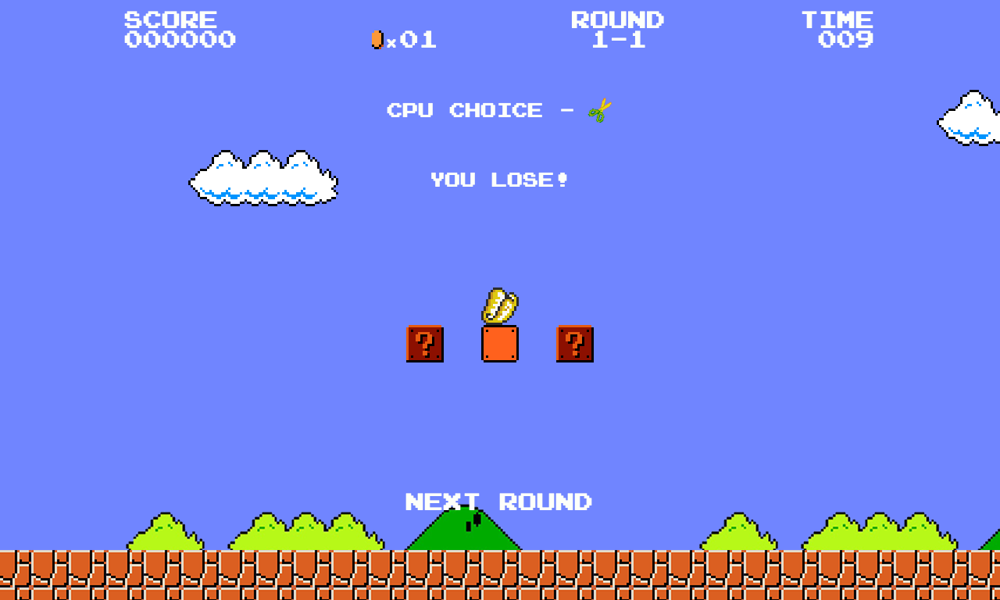

Super Rock Paper Scissors - v2.0.0
=====

Super Rock Paper Scissors was built in honour of the old 8bit systems, in particular the NES. The design is a twist on the original Super Mario Bros. released in 1985.

Features
---
Super Rock Paper Scissors includes the following features:

* Scoring System
    * Keeps a record of your high score
    * Earn more points the more times you win consecutively

* Gameplay
    * Features a game of 10 rounds
    * Each round is timed
    * Face off against the CPU
    
SetUp
---

Simply clone down this repository and run `yarn install`.

Once you have all the dependencies installed you can spin up the app on `localhost:3000` by using either:
    
     yarn dev

Technologies
---
Super Rock Paper Scissors v2 is build using React on NextJS with Typescript. 

Additions include:
* `redux` - For state management - https://github.com/reactjs/redux

Testing
---
Jest was used for the unit tests included. https://github.com/facebook/jest There are 67 tests across 3 suits. The majority of the test cases test the game logic such as the outcome of your play.

Tests are located in `__test__` folders adjacent to the files they're testing.

To run the tests simply do the following after set up:

    yarn test
    
You will be prompted to press `a` to run all the tests.

How to Play
---

When the game starts up you will be on a title screen simply select `1 player game` to being playing!

When you start the game you will notice 3 `?` blocks, hovering over these boxes will show you what is inside, click on a box to select that option. When you have selected an option the CPU player will reveal their choice and the result will be displayed. To start the next round simply click on `Next Round`.

There are 10 rounds in total, see if you can get the highest possible score!

Development Time
---

_To be added_

Improvements
---

_To be added_